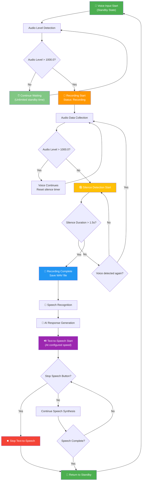

# 🎙️ Voice Recognition AI Application v2.0

> **Next-generation voice-to-AI conversation system with collapsible settings panel and multimodal support**

[](https://kotlinlang.org/)
[](https://www.jetbrains.com/lp/compose-multiplatform/)
[](https://m3.material.io/)
[](LICENSE)

A sophisticated voice recognition application built with **Compose Multiplatform** that seamlessly integrates speech recognition, AI response generation, and text-to-speech synthesis. Features a modern Material Design 3 interface with collapsible settings panel for optimal user experience.

## ✨ Key Features

### 🎯 **Core Functionality**
- **🎤 Automatic Voice Detection**: Smart voice activity detection with optimized silence handling
- **🤖 AI Response Generation**: Integration with multiple Ollama models (Gemma2, Gemma3, Gemma3:1B)
- **🔊 Text-to-Speech Synthesis**: Built-in speech synthesis with adjustable speed control
- **📋 Collapsible Settings Panel**: Expandable/collapsible interface for maximum output area
- **🖼️ Multimodal Support**: Image processing capabilities with Gemma3 models

### 🎨 **Modern UI/UX**
- **Material Design 3**: Beautiful, consistent design language
- **Responsive Layout**: Adaptive interface that works on various screen sizes
- **Smooth Animations**: Fluid expand/collapse animations for settings panel
- **Real-time Controls**: Status bar with speech speed adjustment and stop controls
- **Dark Theme Ready**: Modern color palette with excellent contrast

### ⚡ **Performance Optimizations**
- **Declarative UI**: Fast rendering with Compose Multiplatform
- **Efficient Memory Usage**: Optimized audio processing and model management
- **Background Processing**: Non-blocking AI operations with coroutines
- **Smart Caching**: Intelligent model loading and resource management

---

## 🔄 Voice Processing Flow

The application follows an optimized voice processing workflow that balances natural conversation with efficient processing:



### 🎯 **Flow Optimization Features**

#### **Smart Waiting Strategy**
- **Unlimited Initial Standby**: No pressure to start speaking immediately
- **Instant Voice Detection**: Responds immediately when voice is detected (>1000.0 threshold)
- **Efficient Post-Speech Processing**: 1.5-second silence detection after speech begins

#### **Intelligent Processing**
- **Quick Termination**: Fast transition from recording to AI processing
- **Real-time Feedback**: Live status updates throughout the entire process
- **User Control**: Ability to interrupt speech synthesis at any point

#### **Natural Conversation Flow**
- **Relaxed Initial State**: Take your time before speaking
- **Responsive Processing**: Quick AI response generation once speech ends
- **Full Interrupt Control**: Stop and restart conversation at any moment

---

## 🎛️ Collapsible Settings Panel

### 📋 **Panel Features**
The revolutionary collapsible settings panel maximizes your output viewing area while keeping all controls easily accessible.

#### **Expanded State**
```
┌─────────────────────────────────────────────────────────────────┐
│ 🔧 Settings                                                  ⌄ │ ← Click to collapse
├─────────────────────────────────────────────────────────────────┤
│ 🤖 AI Model Selection                                           │
│   🏆 Gemma2 (9B)    🎨 Gemma3 (4B)    ⚡ Gemma3:1B (815MB)    │
│                                                                 │
│ 📝 Prompt Configuration                                         │
│   [Custom Prompt Dropdown ▼]                                   │
│                                                                 │
│ 🖼️ Image Upload (Gemma3 only)                                  │
│   [Choose File] selected_image.png [×]                         │
│                                                                 │
│ 🔊 Speech Synthesis Controls                                    │
│   [Stop Speech] [Recording Available]                          │
│   Speech Speed: 200 wpm [────●────]                            │
└─────────────────────────────────────────────────────────────────┘
```

#### **Collapsed State**
```
┌─────────────────────────────────────────────────────────────────┐
│ 🔧 Settings                                                  ⌃ │ ← Click to expand
└─────────────────────────────────────────────────────────────────┘
```

### ⚡ **Benefits**
- **Maximized Output Area**: Up to 70% more space for AI responses
- **One-Click Toggle**: Instant expand/collapse with smooth animations
- **Persistent State**: Settings remain configured when collapsed
- **Mobile-Friendly**: Optimized for smaller screens and touch interfaces

---

## 🤖 AI Model Support

### 📊 **Available Models**

| Model | Size | Capabilities | Performance | Use Case |
|-------|------|--------------|-------------|----------|
| **🏆 Gemma2** | 9.2B params | High-quality text generation | Slower, highest quality | Complex reasoning, detailed responses |
| **🎨 Gemma3** | 4.3B params | Multimodal (text + images) | Balanced | Image analysis, visual Q&A |
| **⚡ Gemma3:1B** | 815MB | Lightweight, fast responses | Fastest | Quick conversations, real-time chat |

### 🖼️ **Multimodal Capabilities**
When using Gemma3 models, you can:
- **Upload Images**: PNG, JPG, JPEG formats supported
- **Visual Analysis**: Ask questions about uploaded images
- **Combined Processing**: Text + image context for comprehensive responses

---

## 🎨 User Interface

### 🎭 **Material Design 3 Theme**
- **Primary Color**: `#6750A4` - Elegant purple
- **Surface Cards**: Elevated design with shadows
- **Typography**: Hierarchical text design
- **Consistent Spacing**: 8dp grid system

### 🎛️ **Status Bar Controls**
Located at the bottom of the application:
```
┌─────────────────────────────────────────────────────────────────┐
│ ✅ Gemma3:1B Available        [-][200wpm][+][⏹]               │
│ 🎤 Microphone ready. Waiting for voice input...                │
└─────────────────────────────────────────────────────────────────┘
```

#### **Control Functions**
- **[-]**: Decrease speech speed by 50 wpm (minimum 100 wpm)
- **[200wpm]**: Current speech speed display
- **[+]**: Increase speech speed by 50 wpm (maximum 400 wpm)
- **[⏹]**: Stop current speech synthesis (enabled during playback)

---

## 🚀 Installation & Setup

### 📋 **Prerequisites**
- **Java 17+** - Required for Kotlin and Compose Multiplatform
- **Gradle 8.0+** - Build automation
- **macOS** - For `say` command (text-to-speech)
- **Python 3.7+** - For speech recognition module
- **Ollama** - Local LLM server

### 🔧 **Installation Steps**

#### 1. **Clone Repository**
```bash
git clone https://github.com/marutyan/ISP_llama.git
cd ISP_llama/ipro/no11
```

#### 2. **Install Python Dependencies**
```bash
pip install SpeechRecognition
```

#### 3. **Setup Ollama Models**
```bash
# Install Ollama
curl -fsSL https://ollama.ai/install.sh | sh

# Pull required models
ollama pull gemma2
ollama pull gemma3
ollama pull gemma3:1b
```

#### 4. **Build Application**
```bash
./gradlew build
```

#### 5. **Run Application**
```bash
./gradlew run
```

### 📦 **Native Distribution**
Create platform-specific installers:
```bash
# Create DMG for macOS
./gradlew packageDistributionForCurrentOS

# Find installer in: build/compose/binaries/main/
```

---

## 🎯 Usage Guide

### 🎤 **Basic Voice Interaction**
1. **Launch Application**: Run with `./gradlew run`
2. **Wait for Ready State**: Status shows "🎤 Microphone ready..."
3. **Speak Naturally**: Just start talking - no button press needed
4. **Automatic Processing**: Voice → Recognition → AI → Speech synthesis
5. **Repeat**: System automatically returns to listening state

### ⚙️ **Configuration**
1. **Model Selection**: Click desired model in settings panel
2. **Custom Prompts**: Use dropdown to select or enter custom prompts
3. **Image Upload**: (Gemma3 only) Click "Choose File" to add images
4. **Speech Speed**: Use status bar controls or settings slider

### 🎛️ **Advanced Controls**
- **Collapse Settings**: Click "🔧 Settings" header to maximize output area
- **Stop Speech**: Use [⏹] button during AI speech synthesis
- **Speed Adjustment**: Real-time speech speed control (100-400 wpm)
- **Interrupt Processing**: Speech synthesis can be stopped at any time

---

## 🏗️ Technical Architecture

### 📦 **Technology Stack**
```
┌─────────────────────────────────────┐
│        Compose Desktop UI           │
├─────────────────────────────────────┤
│      Material Design 3 Theme       │
├─────────────────────────────────────┤
│       Kotlin Coroutines            │
├─────────────────────────────────────┤
│     OkHttp + Jackson (API)         │
├─────────────────────────────────────┤
│   javax.sound.sampled (Audio)      │
└─────────────────────────────────────┘
```

### 🔧 **Key Dependencies**
```kotlin
// Compose Multiplatform
implementation(compose.desktop.currentOs)
implementation(compose.material3)
implementation(compose.materialIconsExtended)

// API Communication
implementation("com.squareup.okhttp3:okhttp:4.12.0")
implementation("com.fasterxml.jackson.module:jackson-module-kotlin:2.15.2")

// Animation Support
implementation("androidx.compose.animation:animation:1.6.2")
```

### 🎯 **Architecture Patterns**
- **MVVM**: Model-View-ViewModel with Compose State
- **Repository Pattern**: Centralized data management
- **Observer Pattern**: Reactive UI updates with StateFlow
- **Singleton Pattern**: Shared managers (VoiceDetector, SpeechManager)

---

## 🧪 Testing & Quality

### ✅ **Tested Features**
- ✅ Voice detection accuracy
- ✅ AI model switching
- ✅ Multimodal image processing
- ✅ Settings panel collapse/expand
- ✅ Speech synthesis controls
- ✅ Real-time status updates
- ✅ Error handling and recovery

### 📊 **Performance Metrics**
| Feature | Response Time | Resource Usage |
|---------|---------------|----------------|
| Voice Detection | <100ms | Low CPU |
| Settings Toggle | <200ms | Minimal |
| Model Switching | 2-5s | GPU Memory |
| Speech Synthesis | Real-time | Low CPU |

---

## 🔄 Version History

### 🏷️ **v2.0.0 - Collapsible Settings Panel** (Current)
- ✨ **NEW**: Collapsible settings panel with smooth animations
- ✨ **NEW**: Status bar speech controls (speed adjustment, stop button)
- ✨ **NEW**: English documentation with comprehensive flowchart
- 🎨 **IMPROVED**: Material Design 3 implementation
- 🐛 **FIXED**: ModelRadioButton parameter compatibility
- 🐛 **FIXED**: Speech synthesis interruption handling

### 🏷️ **v1.9.0 - Modern UI Foundation**
- ✨ **NEW**: Complete migration to Compose Multiplatform
- ✨ **NEW**: Material Design 3 theme implementation
- ✨ **NEW**: Multimodal support for Gemma3 models
- 🎨 **IMPROVED**: Voice detection logic optimization
- 🎨 **IMPROVED**: Speech synthesis speed controls

### 🏷️ **v1.0.0 - Initial Swing Implementation**
- ✨ Basic voice recognition and AI response
- ✨ Swing-based user interface
- ✨ Single model support (Gemma2)

---

## 🤝 Contributing

### 🛠️ **Development Setup**
1. Fork the repository
2. Create feature branch: `git checkout -b feature/amazing-feature`
3. Commit changes: `git commit -m 'Add amazing feature'`
4. Push to branch: `git push origin feature/amazing-feature`
5. Open Pull Request

### 📝 **Code Style**
- Follow Kotlin coding conventions
- Use meaningful variable names
- Add documentation for public functions
- Maintain consistent indentation (4 spaces)

### 🐛 **Bug Reports**
Please include:
- Operating system and version
- Java/Kotlin version
- Steps to reproduce
- Expected vs actual behavior
- Screenshots (if applicable)

---

## 📄 License

This project is licensed under the MIT License - see the [LICENSE](LICENSE) file for details.

---

## 🙏 Acknowledgments

- **JetBrains** - For Compose Multiplatform framework
- **Google** - For Material Design 3 specifications
- **Ollama Team** - For local LLM server technology
- **Kotlin Community** - For excellent language support

---

## 📞 Support

- 🐛 **Issues**: [GitHub Issues](https://github.com/marutyan/ISP_llama/issues)
- 💬 **Discussions**: [GitHub Discussions](https://github.com/marutyan/ISP_llama/discussions)
- 📧 **Contact**: Open an issue for direct contact

---

<div align="center">

**Built with ❤️ using Kotlin and Compose Multiplatform**

[⭐ Star this project](https://github.com/marutyan/ISP_llama) • [🔀 Fork](https://github.com/marutyan/ISP_llama/fork) • [📥 Download](https://github.com/marutyan/ISP_llama/releases)

</div> 
