# 🎙️ Voice Recognition AI Application v2.0

> **Next-generation voice-to-AI conversation system with collapsible settings panel and multimodal support**

[](https://kotlinlang.org/)
[](https://www.jetbrains.com/lp/compose-multiplatform/)
[](https://m3.material.io/)

A sophisticated voice recognition application built with **Compose Multiplatform** that seamlessly integrates speech recognition, AI response generation, and text-to-speech synthesis. Features a modern Material Design 3 interface with collapsible settings panel for optimal user experience.

## ✨ Key Features

### 🎯 **Core Functionality**
- **🎤 Automatic Voice Detection**: Smart voice activity detection with optimized silence handling
- **🤖 AI Response Generation**: Integration with multiple Ollama models (Gemma2, Gemma3, Gemma3:1B)
- **🔊 Text-to-Speech Synthesis**: Built-in speech synthesis with adjustable speed control
- **📋 Collapsible Settings Panel**: Expandable/collapsible interface for maximum output area
- **🖼️ Multimodal Support**: Image processing capabilities with Gemma3 models

### 🎨 **Modern UI/UX**
- **Material Design 3**: Beautiful, consistent design language
- **Responsive Layout**: Adaptive interface that works on various screen sizes
- **Smooth Animations**: Fluid expand/collapse animations for settings panel
- **Real-time Controls**: Status bar with speech speed adjustment and stop controls
- **Dark Theme Ready**: Modern color palette with excellent contrast

### ⚡ **Performance Optimizations**
- **Declarative UI**: Fast rendering with Compose Multiplatform
- **Efficient Memory Usage**: Optimized audio processing and model management
- **Background Processing**: Non-blocking AI operations with coroutines
- **Smart Caching**: Intelligent model loading and resource management

---

## 🔄 Voice Processing Flow

The application follows an optimized voice processing workflow that balances natural conversation with efficient processing:

```mermaid
graph TD
    A["🎤 Voice Input Start<br/>(Standby State)"] --> B["Audio Level Detection"]
    B --> C{Audio Level > 1000.0?}
    C -->|No| D["⏰ Continue Waiting<br/>(Unlimited standby time)"]
    D --> B
    C -->|Yes| E["📢 Recording Start<br/>Status: Recording"]
    E --> F["Audio Data Collection"]
    F --> G{Audio Level > 1000.0?}
    G -->|Yes| H["Voice Continues<br/>Reset silence timer"]
    H --> F
    G -->|No| I["🔇 Silence Detection Start"]
    I --> J{Silence Duration > 1.5s?}
    J -->|No| K{Voice detected again?}
    K -->|Yes| F
    K -->|No| I
    J -->|Yes| L["📁 Recording Complete<br/>Save WAV file"]
    L --> M["🤖 Speech Recognition"]
    M --> N["🧠 AI Response Generation"]
    N --> O["🔊 Text-to-Speech Start<br/>(At configured speed)"]
    O --> P{Stop Speech Button?}
    P -->|Yes| Q["⏹️ Stop Text-to-Speech"]
    P -->|No| R["Continue Speech Synthesis"]
    R --> S{Speech Complete?}
    S -->|No| P
    S -->|Yes| T["🎤 Return to Standby"]
    Q --> T
    T --> A

    style A fill:#4CAF50,color:#fff
    style D fill:#81C784,color:#fff
    style E fill:#FF9800,color:#fff
    style I fill:#FFC107,color:#fff
    style L fill:#2196F3,color:#fff
    style O fill:#9C27B0,color:#fff
    style Q fill:#F44336,color:#fff
    style T fill:#4CAF50,color:#fff
```



### 🎯 **Flow Optimization Features**

#### **Smart Waiting Strategy**
- **Unlimited Initial Standby**: No pressure to start speaking immediately
- **Instant Voice Detection**: Responds immediately when voice is detected (>1000.0 threshold)
- **Efficient Post-Speech Processing**: 1.5-second silence detection after speech begins

#### **Intelligent Processing**
- **Quick Termination**: Fast transition from recording to AI processing
- **Real-time Feedback**: Live status updates throughout the entire process
- **User Control**: Ability to interrupt speech synthesis at any point

#### **Natural Conversation Flow**
- **Relaxed Initial State**: Take your time before speaking
- **Responsive Processing**: Quick AI response generation once speech ends
- **Full Interrupt Control**: Stop and restart conversation at any moment

---

## 🤖 AI Model Support

### 📊 **Available Models**

| Model | Size | Capabilities | Performance | Use Case |
|-------|------|--------------|-------------|----------|
| **🏆 Gemma2** | 9.2B params | High-quality text generation | Slower, highest quality | Complex reasoning, detailed responses |
| **🎨 Gemma3** | 4.3B params | Multimodal (text + images) | Balanced | Image analysis, visual Q&A |
| **⚡ Gemma3:1B** | 815MB | Lightweight, fast responses | Fastest | Quick conversations, real-time chat |

### 🖼️ **Multimodal Capabilities**
When using Gemma3 models, you can:
- **Upload Images**: PNG, JPG, JPEG formats supported
- **Visual Analysis**: Ask questions about uploaded images
- **Combined Processing**: Text + image context for comprehensive responses
---

## 🚀 Installation & Setup

### 📋 **Prerequisites**
- **Java 17+** - Required for Kotlin and Compose Multiplatform
- **Gradle 8.0+** - Build automation
- **macOS** - For `say` command (text-to-speech)
- **Python 3.7+** - For speech recognition module
- **Ollama** - Local LLM server

### 🔧 **Installation Steps**

#### 1. **Clone Repository**
```bash
git clone https://github.com/marutyan/ISP_llama.git
cd ISP_llama/ipro/no11
```

#### 2. **Install Python Dependencies**
```bash
pip install SpeechRecognition
```

#### 3. **Setup Ollama Models**
```bash
# Install Ollama
curl -fsSL https://ollama.ai/install.sh | sh

# Pull required models
ollama pull gemma2
ollama pull gemma3
ollama pull gemma3:1b
```

#### 4. **Build Application**
```bash
./gradlew build
```

#### 5. **Run Application**
```bash
./gradlew run
```

### 📦 **Native Distribution**
Create platform-specific installers:
```bash
# Create DMG for macOS
./gradlew packageDistributionForCurrentOS

# Find installer in: build/compose/binaries/main/
```

---

## 🎯 Usage Guide

### 🎤 **Basic Voice Interaction**
1. **Launch Application**: Run with `./gradlew run`
2. **Wait for Ready State**: Status shows "🎤 Microphone ready..."
3. **Speak Naturally**: Just start talking - no button press needed
4. **Automatic Processing**: Voice → Recognition → AI → Speech synthesis
5. **Repeat**: System automatically returns to listening state

### ⚙️ **Configuration**
1. **Model Selection**: Click desired model in settings panel
2. **Custom Prompts**: Use dropdown to select or enter custom prompts
3. **Image Upload**: (Gemma3 only) Click "Choose File" to add images
4. **Speech Speed**: Use status bar controls or settings slider

### 🎛️ **Advanced Controls**
- **Collapse Settings**: Click "🔧 Settings" header to maximize output area
- **Stop Speech**: Use [⏹] button during AI speech synthesis
- **Speed Adjustment**: Real-time speech speed control (100-400 wpm)
- **Interrupt Processing**: Speech synthesis can be stopped at any time

---

## 🏗️ Technical Architecture

### 📦 **Technology Stack**
```
┌─────────────────────────────────────┐
│        Compose Desktop UI           │
├─────────────────────────────────────┤
│      Material Design 3 Theme       │
├─────────────────────────────────────┤
│       Kotlin Coroutines            │
├─────────────────────────────────────┤
│     OkHttp + Jackson (API)         │
├─────────────────────────────────────┤
│   javax.sound.sampled (Audio)      │
└─────────────────────────────────────┘
```

### 🔧 **Key Dependencies**
```kotlin
// Compose Multiplatform
implementation(compose.desktop.currentOs)
implementation(compose.material3)
implementation(compose.materialIconsExtended)

// API Communication
implementation("com.squareup.okhttp3:okhttp:4.12.0")
implementation("com.fasterxml.jackson.module:jackson-module-kotlin:2.15.2")

// Animation Support
implementation("androidx.compose.animation:animation:1.6.2")
```

### 🎯 **Architecture Patterns**
- **MVVM**: Model-View-ViewModel with Compose State
- **Repository Pattern**: Centralized data management
- **Observer Pattern**: Reactive UI updates with StateFlow
- **Singleton Pattern**: Shared managers (VoiceDetector, SpeechManager)

---

<div align="center">

**Built with ❤️ using Kotlin and Compose Multiplatform**

</div> 
