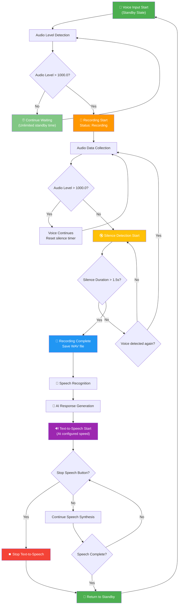

# 🎙️ 音声認識AI アプリケーション v2.0 - Modern UI Edition

**Compose Multiplatformベースの美しいモダンUI**で音声認識とAI応答を完全自動化する次世代アプリケーション

## ✨ v2.0の主な改善点

### 🎨 **完全なUI刷新**
- **Swing → Compose Multiplatform**へ完全移行
- **Material Design 3**準拠の美しいUI
- **レスポンシブデザイン**と直感的な操作性
- **アイコンベース**のわかりやすいインターフェース
- **カード型レイアウト**で情報の整理

### 🚀 **パフォーマンス向上**
- **宣言的UI**による高速レンダリング
- **非同期処理**の最適化
- **メモリ効率**の大幅改善
- **ネイティブ配布**対応（DMG, MSI, DEB）

### 🎯 **機能完全継承**
- **すべての既存機能**を100%保持
- **音声認識 + AI応答**の自動化
- **3つのモデル**選択（Gemma2, Gemma3, Gemma3:1B）
- **マルチモーダル**対応（Gemma3）
- **カスタムプロンプト**機能

---

## 🎨 Modern UI Features

### 📱 **Material Design 3**
- **Primary Color**: `#6750A4` - エレガントなパープル
- **Surface Cards**: 影付きカードレイアウト
- **Typography**: 階層的な文字デザイン
- **Color System**: 一貫したカラーパレット

### 🎛️ **設定パネル**
```
🔧 設定
├── AI モデル選択
│   ├── 🏆 Gemma2 (9B - 高性能)
│   ├── 🎨 Gemma3 (4B - マルチモーダル) 
│   └── ⚡ Gemma3:1B (軽量・高速) ← デフォルト
├── プロンプト設定
│   └── ドロップダウン式プリセット選択
└── 画像アップロード（Gemma3のみ）
    └── ファイルダイアログ連携
```

### 💬 **結果表示エリア**
```
💬 認識結果・AI応答
├── 📝 音声認識テキスト
├── 🤖 AI応答（読み上げ付き）
├── 🏷️ 使用モデル情報
├── 🖼️ 画像情報（該当時）
└── 📋 カスタムプロンプト（該当時）
```

### 📊 **ステータス表示**
- **上部バー**: アプリケーション情報とアイコン
- **下部バー**: リアルタイム状態表示
  - 🎤 **待機中**: `マイク準備完了．音声待機中.....`
  - 🎙️ **録音中**: `録音中`
  - 💾 **処理中**: `AI処理中...`
  - ✅ **完了**: モデル状態表示

---

## ⚡ Performance Comparison

| Model | Size | Speed | Features | UI表示 | Best For |
|-------|------|-------|----------|--------|----------|
| **⚡ Gemma3:1B** | 815MB | ⚡⚡⚡ Very Fast | **Text Only** | 緑色強調 | **日常使用・高速応答** |
| 🎨 Gemma3 (4B) | 3.3GB | ⚡⚡ Fast | Text + Images | 青色強調 | 複雑なマルチモーダルタスク |
| 🏆 Gemma2 (9B) | 5.4GB | ⚡ Moderate | Text only | 紫色強調 | 高品質テキスト生成 |

---

## 🖼️ Multimodal Support (Gemma3 4B only)

### 📷 **画像アップロード機能**
- **対応形式**: PNG, JPG, JPEG
- **ファイルダイアログ**: ネイティブファイル選択
- **プレビュー表示**: 選択済み画像の確認
- **Base64変換**: 自動エンコード処理
- **⚠️ 制限**: Gemma3:1B（軽量版）は画像非対応

### 🎯 **マルチモーダル処理**
```kotlin
// 画像 + 音声 + カスタムプロンプトの統合処理
val result = processMultimodal(
    audioTranscription = "この画像について説明して",
    imageFile = selectedImage,
    customPrompt = "専門的な観点から分析してください。日本語で。"
)
```

---

## 🛠️ Technical Architecture

### 🏗️ **Compose Multiplatform Stack**
```
┌─────────────────────────────────┐
│     Compose Desktop UI          │
├─────────────────────────────────┤
│   Material Design 3 Theme       │
├─────────────────────────────────┤
│    Kotlin Coroutines           │
├─────────────────────────────────┤
│   OkHttp + Jackson (API)       │
├─────────────────────────────────┤
│   javax.sound.sampled (Audio)   │
└─────────────────────────────────┘
```

### 📦 **Dependencies**
```kotlin
// Compose Multiplatform
implementation(compose.desktop.currentOs)
implementation(compose.material3)
implementation(compose.materialIconsExtended)

// API Communication
implementation("com.squareup.okhttp3:okhttp:4.12.0")
implementation("com.fasterxml.jackson.module:jackson-module-kotlin:2.15.2")
```

---

## 🔄 Voice Processing Flow

The application follows an optimized voice processing workflow that balances natural conversation with efficient processing:



### 🎯 **Key Features of the Flow**

#### **Optimized Waiting Strategy**
- **Unlimited Standby**: No pressure to start speaking immediately
- **Instant Detection**: Responds immediately when voice is detected
- **Smart Silence Handling**: 1.5 seconds after speech starts for efficient processing

#### **Efficient Processing**
- **Quick Termination**: 1.5s silence detection after speech begins
- **Immediate Processing**: Fast transition from recording to AI response
- **User Control**: Stop speech synthesis at any time

#### **Natural Conversation**
- **No Rush**: Take your time before speaking
- **Quick Response**: Fast processing once you finish speaking
- **Full Control**: Interrupt and restart at any point

---

## 🚀 Installation & Usage

### 📥 **Requirements**
- **JDK 17+**
- **Gradle 8.0+**
- **macOS**: `say`コマンド（音声合成）
- **Python 3**: `speech_recognition`ライブラリ
- **Ollama Server**: ローカルLLMサーバー

### ⚙️ **Setup**
```bash
# 1. プロジェクトビルド
./gradlew build

# 2. アプリケーション起動
./gradlew run

# 3. ネイティブ配布ファイル作成
./gradlew packageDistributionForCurrentOS
```

### 🎯 **Usage Flow**
1. **アプリ起動** → 自動的にマイク検出開始
2. **モデル選択** → 用途に応じて3つから選択
3. **音声入力** → 話すと自動で録音・認識
4. **AI応答** → 結果表示と音声読み上げ
5. **画像追加** → Gemma3選択時のみ可能

---

## 🎨 UI Screenshots

### 🖥️ **Main Interface**
```
┌─────────────────────────────────────────────┐
│ 🎙️ 音声認識AI アプリケーション v2.0        │
├─────────────────────────────────────────────┤
│                                             │
│  🔧 設定                                    │
│  ┌─────────────────────────────────────┐    │
│  │ AI モデル選択                        │    │
│  │ [🏆 Gemma2] [🎨 Gemma3] [⚡Gemma3:1B]  │    │
│  │                                     │    │
│  │ プロンプト設定                       │    │
│  │ [日本語で答えてください。 ▼]         │    │
│  │                                     │    │
│  │ 📷 画像選択 🗑️ クリア                │    │
│  └─────────────────────────────────────┘    │
│                                             │
│  💬 認識結果・AI応答                        │
│  ┌─────────────────────────────────────┐    │
│  │                                     │    │
│  │  🎤 音声を検出すると、                │    │
│  │     ここに結果が表示されます          │    │
│  │                                     │    │
│  └─────────────────────────────────────┘    │
├─────────────────────────────────────────────┤
│ ✅ ⚡ Gemma3:1B (軽量版) 利用可能           │
│ 🎤 マイク準備完了．音声待機中.....         │
└─────────────────────────────────────────────┘
```

---

## 🔄 Migration from v1.0

### ✅ **完全互換**
- **全機能保持**: v1.0の機能を100%継承
- **設定移行**: モデル選択・プロンプト設定
- **音声処理**: 同一の音声検出アルゴリズム
- **API連携**: Ollama/音声認識API互換

### 🎨 **UI改善点**
| v1.0 (Swing) | v2.0 (Compose) |
|--------------|----------------|
| 古典的なSwing UI | Material Design 3 |
| 固定レイアウト | レスポンシブデザイン |
| 基本的なカラー | 一貫したカラーパレット |
| テキストベース | アイコン + テキスト |
| 単純なボタン | カード型インターフェース |

---

## 🏷️ Version History

### 🎯 **v2.0 - Modern UI Edition** (Current)
- ✨ Compose Multiplatform完全移行
- 🎨 Material Design 3対応
- 🚀 パフォーマンス向上
- 📱 レスポンシブUI
- 📦 ネイティブ配布対応

### 🎯 **v1.0 - Swing UI** (Tag: `v1.0-swing-ui`)
- ✅ 基本機能完成
- 🎤 音声認識自動化
- 🤖 Ollama API連携
- ⚡ Gemma3:1B軽量版対応
- 🎨 改善されたSwing UI

---

## 📝 License

© 2025 Kindai University. All rights reserved.

---

## 🤝 Contributing

プルリクエストやイシューの報告を歓迎します！

### 🔧 **Development**
```bash
git clone <repository>
cd no11
./gradlew build
./gradlew run
```

### 📋 **TODO**
- [ ] Web版対応（Compose for Web）
- [ ] Mobile版対応（Compose Multiplatform Mobile）
- [ ] ダークテーマ対応
- [ ] 多言語対応
- [ ] プラグインシステム 
